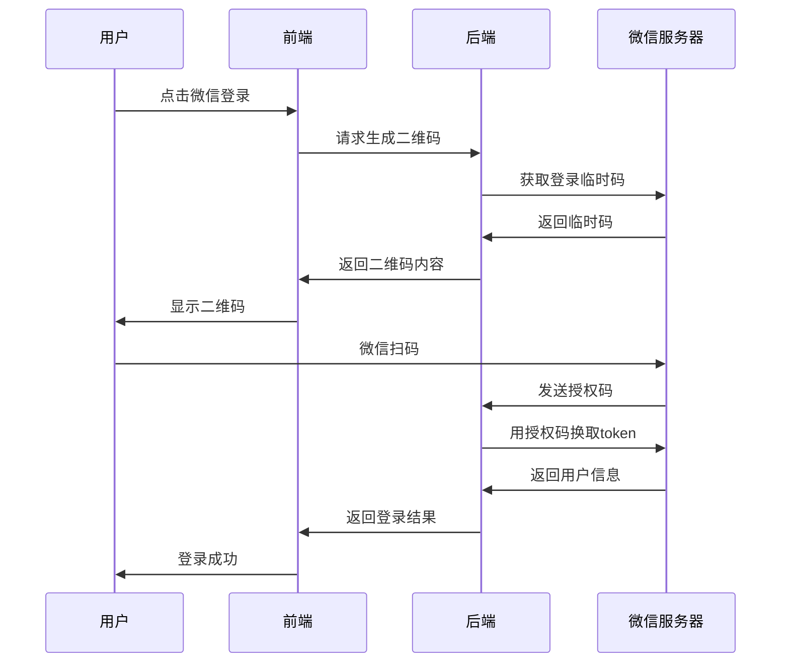

# 微信扫码登录功能实现指南

## 概述

本文档描述了在小马笔记（XiaoMaBiJi）项目中添加微信扫码登录功能的实现方案。当前实现提供了基础框架，可以根据实际需求进行进一步完善。

## 已实现的功能

### 1. 后端支持
- ✅ 在 Rust 后端添加了 `WeChat` 枚举类型到 `ProviderTypePB`
- ✅ 支持微信作为第三方登录提供商

### 2. 前端界面
- ✅ 在第三方登录按钮中添加了微信登录选项
- ✅ 创建了微信扫码登录对话框组件
- ✅ 添加了中文界面文本

### 3. 登录流程
- ✅ 集成到现有的登录状态管理系统
- ✅ 提供了示例的登录成功模拟

## 文件修改清单

### Rust 后端文件
```
frontend/rust-lib/flowy-user/src/entities/auth.rs
- 添加 WeChat = 21 到 ProviderTypePB 枚举
- 添加 "wechat" 字符串映射
```

### Flutter 前端文件
```
frontend/appflowy_flutter/lib/user/presentation/screens/sign_in_screen/widgets/third_party_sign_in_button/
├── third_party_sign_in_button.dart       # 添加微信按钮类型
├── third_party_sign_in_buttons.dart      # 添加微信按钮到界面
└── ...

frontend/appflowy_flutter/lib/user/application/auth/
├── af_cloud_auth_service.dart             # 添加微信平台支持
├── wechat_login_util.dart                 # 微信登录工具类（新建）
└── ...

frontend/appflowy_flutter/lib/user/application/
└── sign_in_bloc.dart                      # 集成微信登录逻辑

frontend/resources/translations/
└── zh-CN.json                             # 添加微信登录文本
```

## 使用方法

### 基本使用
1. 用户在登录页面点击"使用微信扫码登录"按钮
2. 弹出微信登录对话框，显示二维码区域
3. 用户使用微信扫描二维码（当前为模拟实现）
4. 扫码成功后自动登录到应用

### 测试功能
当前实现包含模拟登录，会在10秒后自动登录成功，方便测试整个流程。

## 待完善的功能

### 1. 微信开放平台配置
需要在微信开放平台申请应用：
1. 注册微信开放平台账号
2. 创建网站应用
3. 获取 AppID 和 AppSecret
4. 配置授权回调域名

### 2. 后端API实现
需要实现以下后端接口：
```
POST /api/auth/wechat/qrcode     # 生成登录二维码
GET  /api/auth/wechat/status     # 检查登录状态
POST /api/auth/wechat/callback   # 处理微信回调
```

### 3. 二维码生成
当前使用占位符，需要：
1. 集成 `qr_flutter` 包生成真实二维码
2. 调用后端接口获取二维码内容
3. 实现二维码刷新机制

### 4. 登录状态检测
需要实现：
1. WebSocket 连接用于实时状态更新
2. 轮询机制检查登录状态
3. 超时处理和错误重试

### 5. 安全性增强
- 状态参数验证
- CSRF 防护
- 登录超时机制
- 错误次数限制

## 技术实现细节

### 微信登录流程


### 配置文件
在 `wechat_login_util.dart` 中需要配置：
```dart
static const String appId = 'your_wechat_app_id';
static const String appSecret = 'your_wechat_app_secret';
```

### 环境变量
建议使用环境变量管理敏感信息：
```bash
WECHAT_APP_ID=your_app_id
WECHAT_APP_SECRET=your_app_secret
WECHAT_REDIRECT_URI=https://your-domain.com/auth/wechat/callback
```

## 部署注意事项

### 1. HTTPS 要求
微信登录要求使用 HTTPS，确保：
- 生产环境配置 SSL 证书
- 回调地址使用 HTTPS 协议

### 2. 域名配置
在微信开放平台配置正确的授权回调域名。

### 3. 移动端适配
如果需要支持移动端应用：
- iOS 需要配置 URL Scheme
- Android 需要配置 Intent Filter

## 扩展功能

### 1. 用户信息同步
- 同步微信头像
- 同步微信昵称
- 处理微信用户唯一标识

### 2. 账号绑定
- 支持现有账号绑定微信
- 支持微信账号绑定邮箱

### 3. 多平台登录
- 支持同时使用微信和其他平台登录
- 账号合并功能

## 问题排查

### 常见问题
1. **二维码不显示**：检查后端接口是否正常
2. **扫码无反应**：检查WebSocket连接和轮询逻辑
3. **登录失败**：检查微信配置和回调地址

### 日志监控
建议添加详细的登录日志，包括：
- 二维码生成时间
- 用户扫码时间
- 登录成功/失败状态
- 错误信息记录

## 总结

当前实现提供了完整的微信登录功能框架，包括前端界面、后端支持和基本的登录流程。要在生产环境中使用，还需要完善微信开放平台配置、后端API实现和安全性增强等方面。

该实现遵循了项目现有的架构模式，可以很好地集成到现有的登录系统中。 