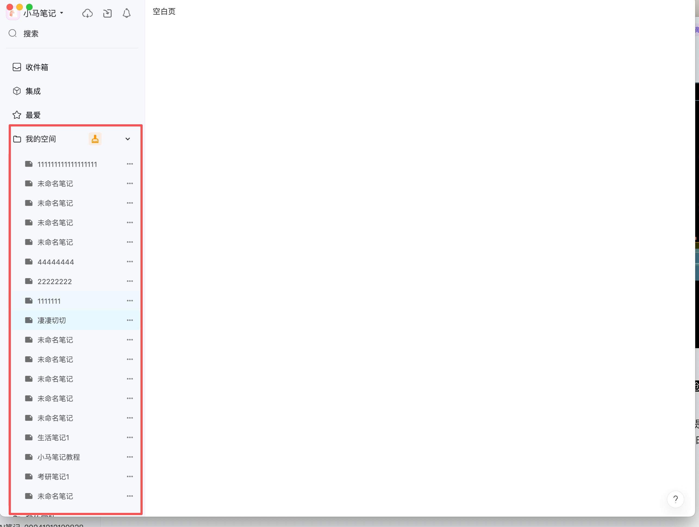

# PonyNotes "我的空间" 主菜单数据存储分析

## 📊 数据存储架构总览

根据对PonyNotes代码和数据库的深入分析，"我的空间"主菜单的数据存储采用了多层架构：

### 🗄️ 数据库层级

1. **SQLite主数据库** (`flowy-database.db`)
   - 存储工作区元数据和文档索引
   - 位置：`~/Library/Application Support/com.appflowy.appflowy.flutter/ponynotes_data_dev_localhost/{user_id}/`

2. **RocksDB协作数据库** (`collab_db/`)
   - 存储实际的文档内容和视图结构
   - 支持实时协作和历史版本

3. **向量数据库** (`vector.db`)
   - 存储AI功能相关的向量化数据

## 🔍 "我的空间" 数据存储详解

### 核心数据表

#### 1. `user_workspace_table` - 工作区基本信息
```sql
SELECT * FROM user_workspace_table;
```

**查询结果**：
```json
{
  "id": "b1fa00aa-234b-4966-904f-69587c9bdf04",
  "name": "My Workspace", 
  "uid": 498120278333722624,
  "created_at": 1756567834,
  "database_storage_id": "d3c2078e-6c0a-4cb5-8ba1-f667af37129a",
  "icon": "",
  "member_count": 1,
  "role": 0,
  "workspace_type": 0
}
```

#### 2. `workspace_members_table` - 工作区成员信息
```sql
SELECT * FROM workspace_members_table;
```

**查询结果**：
```json
{
  "email": "",
  "role": 0,
  "name": "我",
  "avatar_url": "",
  "uid": 498120278333722624,
  "workspace_id": "b1fa00aa-234b-4966-904f-69587c9bdf04",
  "updated_at": "2025-08-31 02:15:02.487540",
  "joined_at": null
}
```

#### 3. `index_collab_record_table` - 文档索引表（核心）
这是"我的空间"菜单项的核心数据表，存储所有文档的索引信息。

```sql
-- 查看所有文档索引（排除工作区根目录）
SELECT oid, workspace_id, content_hash 
FROM index_collab_record_table 
WHERE oid != 'b1fa00aa-234b-4966-904f-69587c9bdf04' 
ORDER BY oid;
```

**统计结果**：
- **总文档数**: 43个文档索引
- **工作区ID**: `b1fa00aa-234b-4966-904f-69587c9bdf04`
- **有内容文档**: 6个（不同的content_hash）
- **空文档**: 37个（相同的content_hash: `ef46db3751d8e999`）

### 🎯 重要发现

#### 有实际内容的文档ID
根据content_hash分析，以下6个文档包含用户创建的实际内容：

1. `2e98d395-634e-4f28-97c8-f94ac42c966c` (hash: `27d19e960a5839ac`)
2. `472fb0be-db0f-4b97-bb22-5df1996cd259` (hash: `14d64f55a982bfbb`)
3. `69771975-e470-46be-8b91-63214edc8b6a` (hash: `0f6a7401ef702f1e`)
4. `7bc47710-b749-44c2-be79-d5a39e2aad0f` (hash: `89349db73990cdd5`)
5. `9fcf6bf8-0496-4589-9a0a-963db0121c6b` (hash: `7849412965cb00d3`)
6. `e1712995-3a5d-4914-83bc-88fbe6dc1720` (hash: `67fa6338ffcb5597`)

## 🔄 数据流转机制

### 前端数据获取流程

#### 1. SidebarSectionsBloc - 主控制器
```dart
// 文件：frontend/appflowy_flutter/lib/workspace/application/menu/sidebar_sections_bloc.dart
class SidebarSectionsBloc extends Bloc<SidebarSectionsEvent, SidebarSectionsState>
```

**核心功能**：
- 管理工作区根视图的不同section
- 分为`publicViews`和`privateViews`两个部分
- "我的空间"菜单显示的是`privateViews`

#### 2. WorkspaceService - 数据服务层
```dart
// 文件：frontend/appflowy_flutter/lib/workspace/application/workspace/workspace_service.dart
Future<FlowyResult<List<ViewPB>, FlowyError>> getPrivateViews() {
  final payload = GetWorkspaceViewPB.create()..value = workspaceId;
  return FolderEventReadPrivateViews(payload).send();
}
```

#### 3. 后端事件处理
```rust
// 文件：frontend/rust-lib/flowy-folder/src/event_handler.rs
pub(crate) async fn read_private_views_handler(
  data: AFPluginData<GetWorkspaceViewPB>,
  folder: AFPluginState<Weak<FolderManager>>,
) -> DataResult<RepeatedViewPB, FlowyError>
```

### 数据获取步骤

1. **前端请求**: `SidebarSectionsBloc` 初始化时调用 `WorkspaceService.getPrivateViews()`
2. **Rust后端**: 通过 `FolderEventReadPrivateViews` 事件处理
3. **数据过滤**: 后端从RocksDB中获取私有视图，过滤掉回收站中的项目
4. **返回结果**: 返回 `List<ViewPB>` 格式的视图列表
5. **UI渲染**: `SidebarMySpaceMenu` 组件根据数据渲染菜单

## 📋 具体查询示例

### 查看工作区基本信息
```sql
SELECT 
  id as workspace_id,
  name as workspace_name,
  uid as user_id,
  member_count,
  workspace_type
FROM user_workspace_table;
```

### 查看所有文档索引
```sql
SELECT 
  oid as document_id,
  content_hash,
  CASE 
    WHEN content_hash = 'ef46db3751d8e999' THEN '空文档'
    WHEN content_hash = '' THEN '工作区根目录'
    ELSE '有内容文档'
  END as document_type
FROM index_collab_record_table
ORDER BY document_type, oid;
```

### 统计文档类型分布
```sql
SELECT 
  CASE 
    WHEN content_hash = 'ef46db3751d8e999' THEN '空文档'
    WHEN content_hash = '' THEN '工作区根目录'
    ELSE '有内容文档'
  END as document_type,
  COUNT(*) as count
FROM index_collab_record_table
GROUP BY document_type;
```

### 查看有内容的文档列表
```sql
SELECT oid as document_id, content_hash
FROM index_collab_record_table 
WHERE content_hash != 'ef46db3751d8e999' 
  AND content_hash != ''
ORDER BY oid;
```

## 🛠️ 实际使用的查询工具

### 1. 快速检查脚本
```bash
./tools/quick_db_check.sh
```

### 2. 详细数据库查看工具
```bash
# 查看表结构
python3 tools/view_database.py inspect "数据库路径"

# 执行SQL查询  
python3 tools/view_database.py query "数据库路径" "SQL语句"
```

### 3. 具体示例
```bash
# 查看工作区信息
python3 tools/view_database.py query \
  "/Users/kuncao/Library/Application Support/com.appflowy.appflowy.flutter/ponynotes_data_dev_localhost/498120278333722624/flowy-database.db" \
  "SELECT * FROM user_workspace_table"

# 查看文档索引统计
python3 tools/view_database.py query \
  "/Users/kuncao/Library/Application Support/com.appflowy.appflowy.flutter/ponynotes_data_dev_localhost/498120278333722624/flowy-database.db" \
  "SELECT content_hash, COUNT(*) as count FROM index_collab_record_table GROUP BY content_hash ORDER BY count DESC"
```

## 🚫 限制说明

### 无法直接查询的数据

1. **文档内容**: 存储在RocksDB中，需要专门的工具访问
2. **视图层级关系**: 存储在RocksDB的协作数据中
3. **文档标题和图标**: 存储在RocksDB中
4. **菜单项的层级结构**: 需要通过Rust后端API获取

### 建议的查看方式

1. **索引和元数据**: 使用SQL查询SQLite数据库
2. **文档内容和结构**: 通过PonyNotes应用界面
3. **层级关系**: 通过前端调试工具或Rust后端日志

## 📈 数据分析结论

### "我的空间"主菜单的数据来源

1. **元数据来源**: SQLite数据库的`index_collab_record_table`表
2. **结构数据来源**: RocksDB的协作数据库
3. **显示逻辑**: 通过`SidebarSectionsBloc`获取`privateViews`
4. **过滤机制**: 排除回收站中的文档

### 当前数据状态

- **工作区**: "My Workspace" (ID: `b1fa00aa-234b-4966-904f-69587c9bdf04`)
- **用户**: "我" (ID: `498120278333722624`)
- **文档总数**: 43个索引记录
- **活跃文档**: 6个有实际内容
- **空白文档**: 37个（可能是已删除或从未编辑的文档）

这样就可以全面了解"我的空间"主菜单的数据存储机制和查询方法了！

---

*分析时间: 2025-08-31*  
*数据来源: PonyNotes开发环境*
